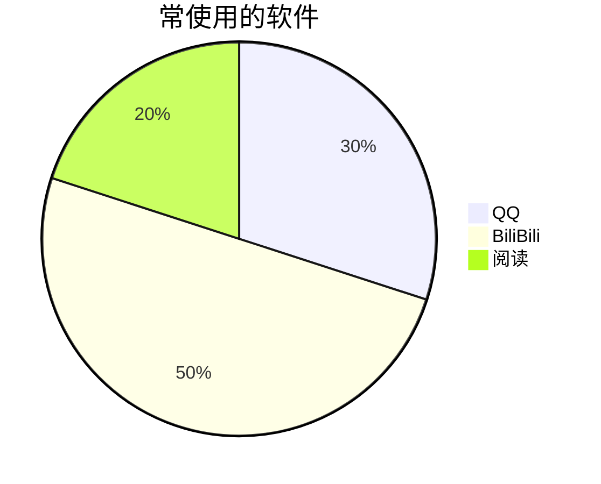
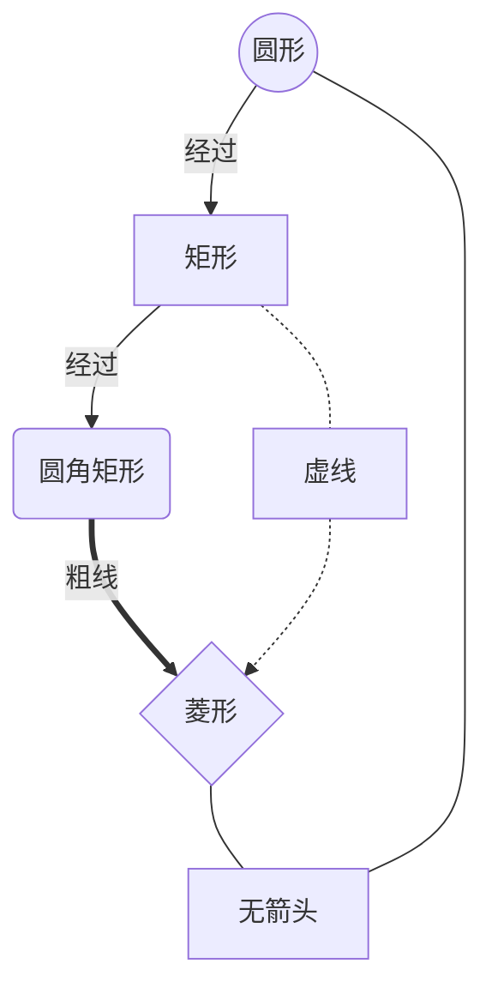

# Mermaid 绘图

## 一、饼图
```
pie        //声明是饼图
title 常使用的软件      //title关键字声明标题内容
"QQ":300                //分别写好每一项  "项":数值
"BiliBili":500          //数值会被自动计算成百分比
"阅读":200
```



## 二、流程图

```
graph TB
A((圆形))-->|经过|B[矩形]--经过-->C(圆角矩形)==粗线==>D{菱形}
B-.虚线.->D
D--A

```

# 三、流程图